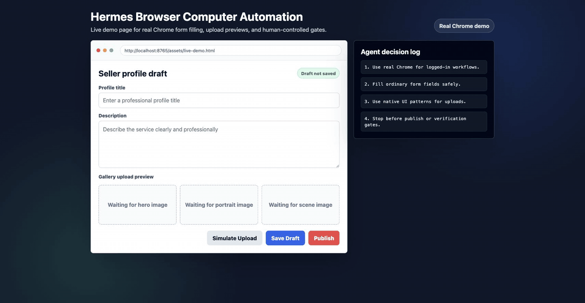

# Hermes Browser Computer Automation

[](LICENSE)


A practical Hermes Agent skill for operating real Chrome sessions and macOS UI workflows: logged-in websites, form filling, seller dashboards, file uploads, gallery setup, and multi-step web tasks.



This demo was recorded in real Google Chrome against the local page at [assets/live-demo.html](assets/live-demo.html). The animated overview is also available at [assets/demo.svg](assets/demo.svg). To record a longer walkthrough, use [docs/DEMO_SCRIPT.md](docs/DEMO_SCRIPT.md).

## Quick Start

```bash
git clone https://github.com/Justin810124/hermes-browser-computer-automation.git
cd hermes-browser-computer-automation
bash scripts/install.sh
bash scripts/doctor.sh
```

Then start a fresh Hermes session and ask:

```text
Use the browser-computer-automation skill.
Use my real Chrome session to continue the page already open.
Fill the form, save drafts, upload files if needed,
and stop for CAPTCHA, PerimeterX, 2FA, identity, tax, payment, or publish.
```

This project teaches Hermes how to combine:

- Hermes `browser` tools for normal web automation
- Hermes `computer_use` for the user's real Chrome session
- CuaDriver for native macOS UI control
- local file helpers for uploads and image selection
- vision checks for screenshots and visual verification

It does **not** bypass CAPTCHA, PerimeterX, Cloudflare, 2FA, identity checks, tax forms, payment flows, or publish gates. Those remain user-controlled steps.

## Why

Many web tasks cannot be completed with a clean automation browser:

- the site requires the user's existing Chrome login cookies
- file upload dialogs are native macOS UI
- dashboards use custom React controls
- anti-bot systems block headless or fresh browser profiles

This skill gives Hermes a reliable decision tree: use browser tools when possible, use real Chrome through Computer Use when needed, and stop for human verification when required.

## Positioning

This is not a stealth browser or anti-bot bypass project. It is a practical operator layer for personal agents that need to work inside the user's own desktop session.

The core idea:

- automate ordinary UI work
- preserve the user's authenticated context
- keep sensitive and irreversible steps under human control
- document the exact boundary between assistance and verification bypass

That makes the project useful for real workflows while remaining safe for contributors, companies, and platforms.

## Install

Clone the repo, then run:

```bash
bash scripts/install.sh
```

Or manually copy:

```bash
mkdir -p "$HOME/.hermes/skills/productivity/browser-computer-automation"
cp skills/productivity/browser-computer-automation/SKILL.md \
  "$HOME/.hermes/skills/productivity/browser-computer-automation/SKILL.md"
```

Then restart or reset your Hermes session so skills are reloaded.

## Check Your Setup

Run:

```bash
bash scripts/doctor.sh
```

The doctor checks:

- Hermes CLI availability
- enabled Hermes toolsets
- CuaDriver installation
- CuaDriver macOS permissions
- installed skill path

See [docs/TROUBLESHOOTING.md](docs/TROUBLESHOOTING.md) when a check fails.

## Required Hermes Toolsets

Enable these Hermes toolsets:

```bash
hermes tools enable browser
hermes tools enable computer_use
hermes tools enable vision
hermes tools enable terminal
hermes tools enable file
hermes tools enable skills
```

Check:

```bash
hermes tools list | rg 'browser|computer_use|vision|terminal|file|skills'
```

## macOS Permissions

For real Chrome and native UI control, CuaDriver needs macOS permissions:

```bash
/Applications/CuaDriver.app/Contents/MacOS/cua-driver doctor
```

If denied, grant these in System Settings -> Privacy & Security:

- Accessibility for `CuaDriver.app`
- Screen Recording for `CuaDriver.app`

Then restart CuaDriver:

```bash
open -n -g -a CuaDriver --args serve
```

## Optional CuaDriver MCP

Hermes has built-in `computer_use`. You can also register CuaDriver as a lower-level MCP server:

```bash
hermes mcp add cua-driver \
  --command /Applications/CuaDriver.app/Contents/MacOS/cua-driver \
  --args mcp

hermes mcp test cua-driver
```

If the CLI asks which tools to enable, choose all tools or select the UI tools you need.

You can also add this to `~/.hermes/config.yaml`:

```yaml
mcp_servers:
  cua-driver:
    command: /Applications/CuaDriver.app/Contents/MacOS/cua-driver
    args:
      - mcp
    enabled: true
    timeout: 120
    connect_timeout: 60
    supports_parallel_tool_calls: false
    tools:
      resources: true
      prompts: true
```

Restart Hermes after editing config.

## Example Prompt

```text
Use the browser-computer-automation skill.
Use my real Chrome session to continue the page already open.
Fill the form, upload the best files from Downloads, save each section,
and stop if you hit CAPTCHA, PerimeterX, identity verification, payment, tax, or publish.
```

More examples:

- [Fiverr seller profile](recipes/fiverr-seller-profile.md)
- [Shopify product media upload](recipes/shopify-product-upload.md)
- [WordPress post editing](recipes/wordpress-post-editing.md)
- [Generic file upload workflow](recipes/generic-file-upload.md)

## Safety Policy

This skill is designed for user-in-the-loop automation.

The agent must stop for:

- CAPTCHA / PerimeterX / reCAPTCHA / Cloudflare Turnstile
- 2FA or device verification
- identity verification
- tax forms such as W-9/W-8
- payment, purchase, subscription, transfer
- publish or final irreversible submit actions
- passwords, API keys, credit cards, SSNs, tax IDs, or identity documents

The user completes or confirms those steps manually.

## Project Scope

Good use cases:

- Fiverr/Upwork/seller profile drafts
- Shopify/Admin dashboards
- SaaS onboarding forms
- image/file upload workflows
- local Chrome tasks that depend on login state

Out of scope:

- bypassing anti-bot systems
- stealth automation
- credential harvesting
- payment automation
- account creation spam

## Repository Layout

```text
.
├── README.md
├── LICENSE
├── CONTRIBUTING.md
├── SECURITY.md
├── assets/
│   ├── demo-real.gif
│   ├── demo.svg
│   └── live-demo.html
├── docs/
│   ├── DEMO_SCRIPT.md
│   ├── LAUNCH_PLAN.md
│   ├── PROMOTION_COPY.md
│   └── TROUBLESHOOTING.md
├── recipes/
│   ├── fiverr-seller-profile.md
│   ├── generic-file-upload.md
│   ├── shopify-product-upload.md
│   └── wordpress-post-editing.md
├── scripts/
│   ├── doctor.sh
│   ├── install.sh
│   └── validate_skill.py
└── skills/
    └── productivity/
        └── browser-computer-automation/
            └── SKILL.md
```

## Roadmap

See [docs/LAUNCH_PLAN.md](docs/LAUNCH_PLAN.md) for the GitHub launch plan, project positioning, and contribution roadmap.

Good first issues:

- add Linux notes for desktop automation equivalents
- add Windows notes for UI Automation equivalents
- add recipes for Shopify, Upwork, WordPress, and Google Workspace
- add a benchmark checklist for form filling reliability
- add screenshots or short demos showing user-in-the-loop flows
